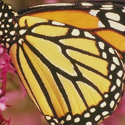
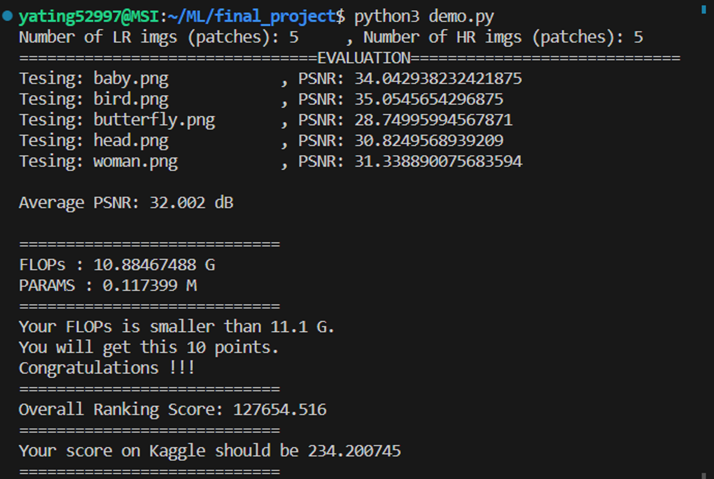

# SuperResolution

The algorithm of this model is based on 
DRLN ( Densely Residual Laplacian Super-resolution ) and 
IMDN ( Lightweight Image Super-Resolution with Information Multi-distillation Network ).

DRLN
[[arXiv]](https://arxiv.org/abs/1906.12021)
[[IEEE]](https://www.computer.org/csdl/journal/tp/5555/01/09185010/1mNmSufHH8c)

IMDN 
[[arXiv]](https://arxiv.org/pdf/1909.11856v1.pdf)
[[Poster]](https://github.com/Zheng222/IMDN/blob/master/images/acmmm19_poster.pdf)
[[ACM DL]](https://dl.acm.org/doi/10.1145/3343031.3351084)


## final result
Average PSNR: 32.002dB、FLOPs: 10.88G、PARAMS: 0.1173M

total training 1050 epochs(RTX 4050, 1min/epoch)

| Low resolution | prediction | original picture |
| ------- | ------- | ------- |
|  |  |  |



## directories and files
- checkpoint
  - model.pth
- checkpoint_drlndw
  - checkpoint.pth
  - model.pth
  - pictures...
- DIV2K_decoded
  - DIV2K_train_HR
  - DIV2K_train_LR_bicubic
  - DIV2K_valid_HR
  - DIV2K_valid_LR_bicubic
- Flickr2K_decoded
  - Flickr2K_HR
  - Flickr2K_LR_bicubic
- model
  - drln_dw.py
  - opsdw.py
- pictures
  - pred_set5.png...
- Set5
- test
- dataset.py
- demo.py
- draw_set5.py
- draw.py
- train.py
- png2npy.py
- README.md

## How to train

### 1. donwload dataset, using png2npy.py transform .png to .npy
```python
python png2npy.py --pathFrom /path/to/DIV2K/ --pathTo /path/to/DIV2K_decoded/
```
```python
python png2npy.py --pathFrom /path/to/Flickr2K/ --pathTo /path/to/Flickr2K_decoded/
```
### 2. train model
```python
python train.py
```
